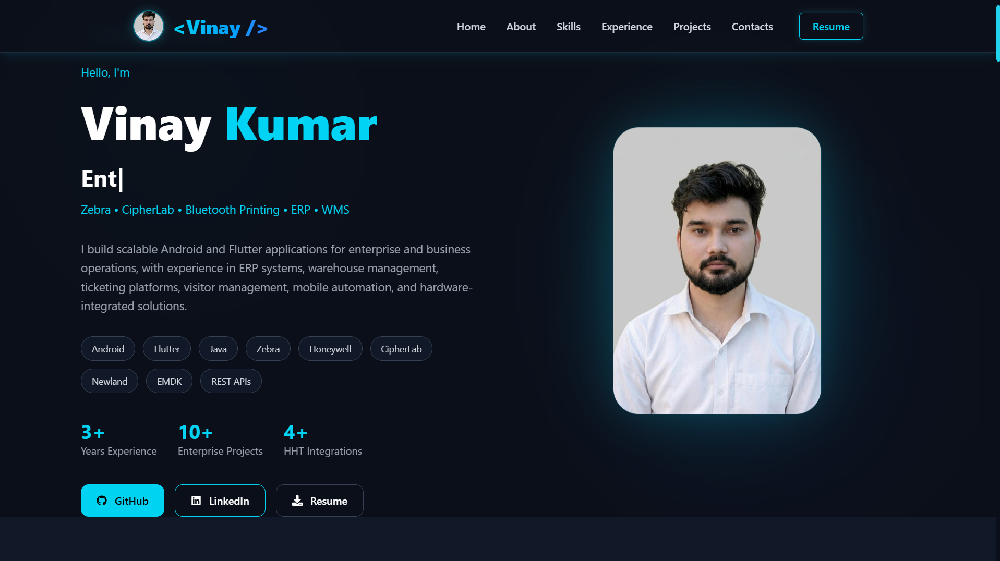
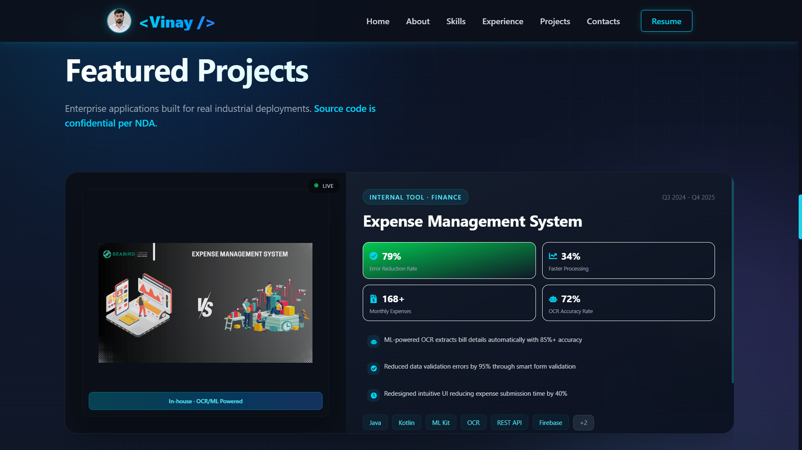
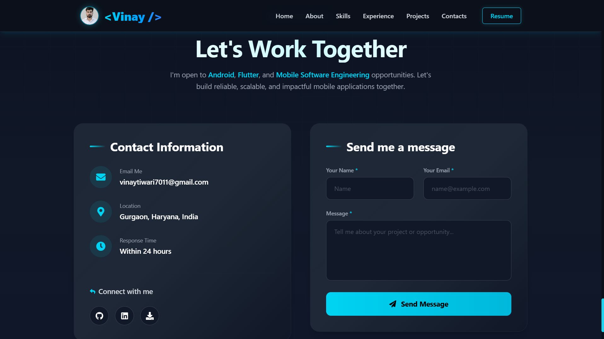

<div align="center">

# Vinay Kumar — Portfolio

### Android & Flutter Developer building enterprise-grade mobile apps that run on real warehouse floors, not just demos.

🌐 **Live Portfolio**  
https://vinay-portfolio-beryl.vercel.app

</div>

---

## About

This repository contains the source code for my personal portfolio website.

I'm an **Android & Flutter Developer** with **3+ years of experience** building enterprise mobile applications for logistics, warehouse management, HRMS, visitor management, and ticketing systems.

The portfolio showcases my technical skills, professional experience, featured projects, certifications, and provides a working contact form for recruiters and clients.

---

## ✨ Features

- Responsive modern portfolio
- Smooth scrolling navigation
- Dark / Light theme
- Animated hero section
- Interactive project showcase
- GitHub contribution calendar
- Working contact form powered by EmailJS
- Mobile-friendly layout
- Framer Motion animations

---

## 🚀 Tech Stack

### Frontend

- React 19
- Vite

### Styling

- Tailwind CSS 4

### Animations

- Framer Motion
- tsParticles
- React Type Animation

### UI Libraries

- Swiper
- React Scroll
- React Icons

### Integrations

- EmailJS
- React GitHub Calendar

---

## 📂 Portfolio Sections

- Hero
- About
- Expertise
- Skills
- Projects
- Experience
- Certifications
- Contact

---

## 🌟 Featured Projects

### Warehouse Management System (WMS)

Enterprise warehouse solution built with Flutter.

**Key Features**

- Barcode Scanning
- Zebra Handheld (HHT) Integration
- Bluetooth Printing
- ERP Integration
- Pick List Management
- Shipment Management
- Stock Movement
- Returns Processing

**Production Status**

This application is deployed in production and actively used across multiple warehouses for day-to-day warehouse operations.

---

### Visitor Management System

- Face Recognition
- Visitor Check-in
- Employee Approval Workflow
- Digital Pass Generation

---

### Expense Tracker

- OCR-based Bill Scanning
- Expense Management
- Analytics Dashboard

---

### IT Ticketing Platform

- Ticket Creation
- Status Tracking
- User Management
- Internal Support Workflow

---

## 🖥️ Preview







---

## ⚙️ Getting Started

### Clone the repository

```bash
git clone https://github.com/VinayTiwari023/vinay-portfolio.git

cd vinay-portfolio
```

### Install dependencies

```bash
npm install
```

### Start development server

```bash
npm run dev
```

Open:

```
http://localhost:5173
```

---

## 📦 Available Scripts

```bash
npm run dev
npm run build
npm run preview
npm run lint
```

---

## 🔐 Environment Variables

Create a `.env` file in the project root.

```env
VITE_EMAILJS_SERVICE_ID=your_service_id
VITE_EMAILJS_TEMPLATE_ID=your_template_id
VITE_EMAILJS_PUBLIC_KEY=your_public_key
```

---

## 🚀 Deployment

This portfolio is deployed on **Vercel** with automatic deployment from the **main** branch.

---

## 👨‍💻 Connect With Me

**Portfolio**  
https://vinay-portfolio-beryl.vercel.app

**GitHub**  
https://github.com/VinayTiwari023

**LinkedIn**  
www.linkedin.com/in/vinay-kumar-android

**Email**  
vinaytiwari7011@gmail.com

---

Made with ❤️ using React, Vite and Tailwind CSS.