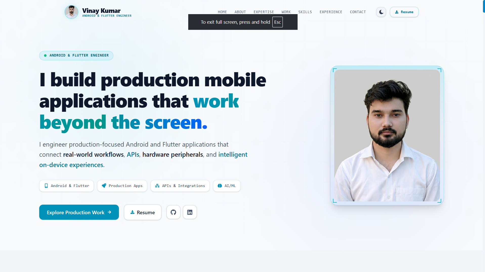
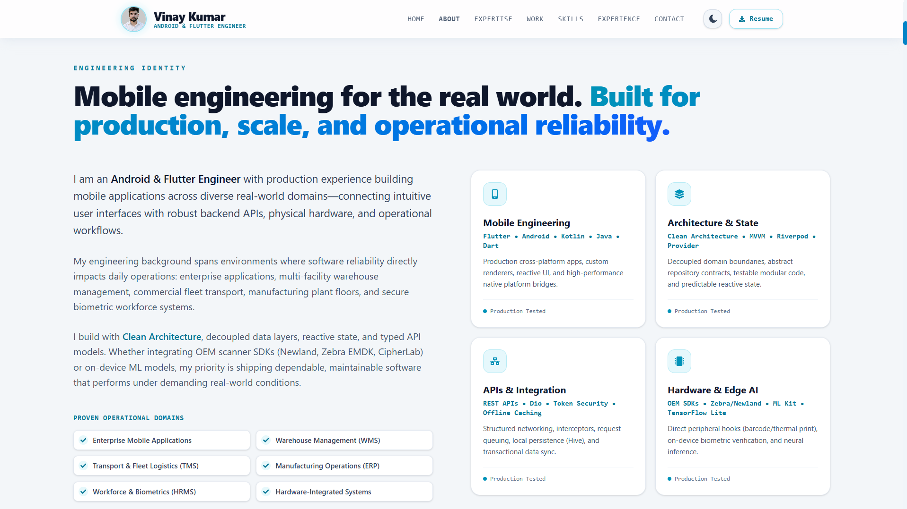
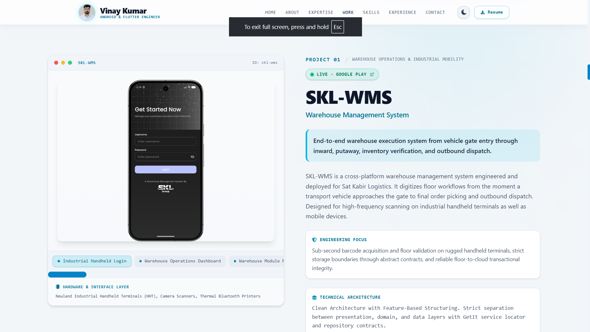
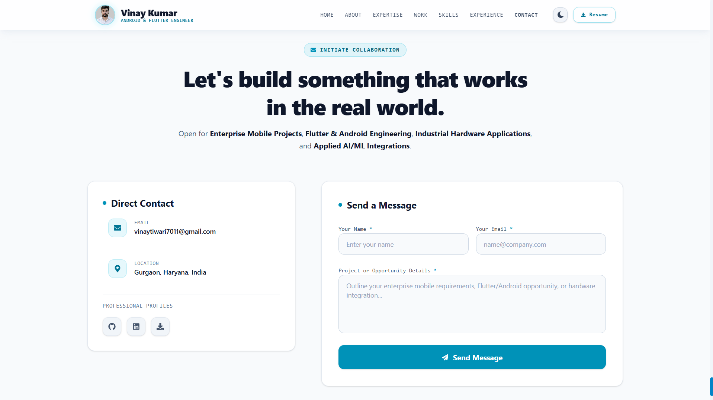

<div align="center">

# Vinay Kumar — Portfolio

### Android & Flutter Developer building enterprise-grade mobile apps that run on real warehouse floors, not just demos.

<p>
  <a href="https://vinay-portfolio-beryl.vercel.app">
    
  </a>
  <a href="https://github.com/VinayTiwari023">
    
  </a>
  <a href="https://www.linkedin.com/in/vinay-kumar-android">
    
  </a>
</p>

</div>

---

## 👋 About

This repository contains the source code for my personal portfolio website.

I'm an **Android & Flutter Developer with 3+ years of experience** building enterprise mobile applications for real-world business workflows, including:

- Logistics & Warehouse Management
- HRMS
- Visitor Management
- IT Ticketing
- Business-focused mobile applications

The portfolio brings together my **technical skills, professional experience, featured projects, certifications, and contact information** in one place.

> **Build for production. Build for people. Build for the workflow.**

---

## ✨ What You'll Find

| | |
|---|---|
| 📱 **Responsive Experience** | Modern portfolio optimized for desktop, tablet, and mobile |
| 🎨 **Modern UI** | Clean interface with dark/light theme support |
| ⚡ **Motion** | Framer Motion-powered interactions and animations |
| 🧩 **Project Showcase** | Interactive presentation of selected projects |
| 🐙 **GitHub Activity** | GitHub contribution calendar integration |
| 📬 **Contact Form** | EmailJS-powered contact form |
| 📱 **Mobile Friendly** | Designed to work smoothly across screen sizes |

---

## 🛠️ Tech Stack

### Frontend


### Styling


### Animation & Interaction


### UI Libraries


### Integrations


---

## 🧭 Portfolio Sections

```text
Hero
 ├── About
 ├── Expertise
 ├── Skills
 ├── Projects
 ├── Experience
 ├── Certifications
 └── Contact
```

Each section is designed to give recruiters and visitors a quick view of **what I build, how I work, and the kind of engineering problems I solve**.

---

## 🌟 Featured Projects

### 📦 Warehouse Management System — Flutter

A production-deployed warehouse application focused on operational workflows.

**Highlights**

- Barcode Scanning
- Zebra Handheld (HHT) Integration
- Bluetooth Printing
- ERP Integration
- Pick List Management
- Shipment Management
- Stock Movement
- Returns Processing

> Production deployed and actively used across multiple warehouses.

---

### 👤 Visitor Management System

A visitor-management solution focused on a smoother and more controlled check-in experience.

**Highlights**

- Face Recognition
- Visitor Check-in
- Employee Approval Workflow
- Digital Pass Generation

---

### 💰 Expense Tracker

An expense management application with OCR-powered bill processing.

**Highlights**

- OCR-based Bill Scanning
- Expense Management
- Analytics Dashboard

---

### 🎫 IT Ticketing Platform

A support workflow application for creating, tracking, and managing internal IT requests.

**Highlights**

- Ticket Creation
- Status Tracking
- User Management
- Internal Support Workflow

---

## 🖥️ Portfolio Preview

### Home


### About


### Projects


### Contact


---

## ⚙️ Getting Started

### 1. Clone the repository

```bash
git clone https://github.com/VinayTiwari023/vinay-portfolio.git
cd vinay-portfolio
```

### 2. Install dependencies

```bash
npm install
```

### 3. Start the development server

```bash
npm run dev
```

Open the local development server:

```text
http://localhost:5173
```

---

## 📦 Available Scripts

| Command | Purpose |
|---|---|
| `npm run dev` | Start the development server |
| `npm run build` | Build the project for production |
| `npm run preview` | Preview the production build |
| `npm run lint` | Run ESLint |

---

## 🔐 Environment Variables

Create a `.env` file in the project root:

```env
VITE_EMAILJS_SERVICE_ID=your_service_id
VITE_EMAILJS_TEMPLATE_ID=your_template_id
VITE_EMAILJS_PUBLIC_KEY=your_public_key
```

These variables are used by the **EmailJS contact form integration**.

---

## 🚀 Deployment

This portfolio is deployed on **Vercel** with automatic deployment from the **`main` branch**.

🌐 **Live:** https://vinay-portfolio-beryl.vercel.app

---

## 👨‍💻 Connect With Me

<p>
  <a href="https://vinay-portfolio-beryl.vercel.app">🌐 Portfolio</a> ·
  <a href="https://github.com/VinayTiwari023">🐙 GitHub</a> ·
  <a href="https://www.linkedin.com/in/vinay-kumar-android">💼 LinkedIn</a> ·
  <a href="mailto:vinaytiwari7011@gmail.com">✉️ Email</a>
</p>

---

<div align="center">

### Built with ❤️ using React, Vite & Tailwind CSS

**Thanks for visiting.**

</div>
